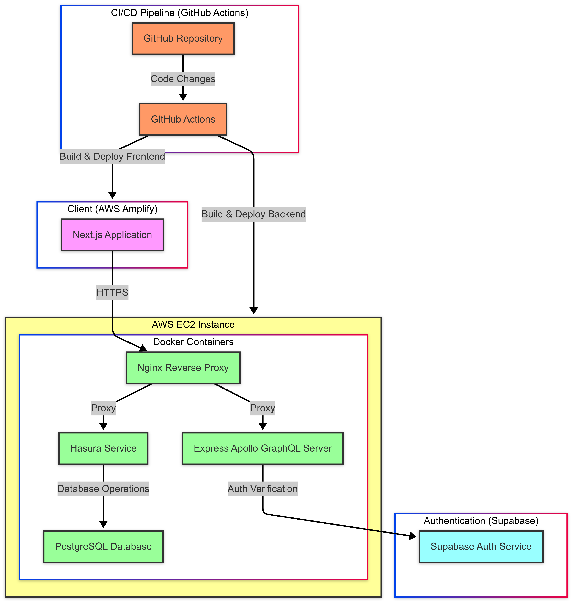

# FutureKonnect

A modern dashboard application built with Next.js, Express, Hasura, and Supabase authentication.

## Live Demo

The application is live at: [https://main.d1wy5b8bimscwn.amplifyapp.com](https://main.d1wy5b8bimscwn.amplifyapp.com)

## Architecture



The application consists of the following components:
- Frontend: Next.js application hosted on AWS Amplify
- Backend: Express Apollo GraphQL server
- Database: PostgreSQL with Hasura
- Authentication: Supabase
- Infrastructure: AWS EC2 with Docker containers
- CI/CD: GitHub Actions

## Prerequisites

- Node.js (v18 or higher)
- Docker and Docker Compose
- Git

## Local Development Setup

### 1. Backend Setup

1. Navigate to the backend directory:
   ```bash
   cd futurekonnect-backend
   ```

2. Install dependencies:
   ```bash
   npm install
   ```

3. Set up environment variables

4. Start the Docker containers:
   ```bash
   docker-compose up -d
   ```

### 2. Frontend Setup

1. Navigate to the frontend directory:
   ```bash
   cd futurekonnect-frontend
   ```

2. Install dependencies:
   ```bash
   npm install
   ```

3. Set up environment variables

4. Start the development server:
   ```bash
   npm run dev
   ```

## Docker Services

The application uses the following Docker services:
- Express Apollo GraphQL server
- Hasura
- PostgreSQL

These services are defined in the `docker-compose.yml` file in the backend directory.

## Development Workflow

1. Make changes to the code
2. Push changes to GitHub
3. GitHub Actions automatically:
   - Deploys the backend to EC2
   - Deploys the frontend to AWS Amplify
